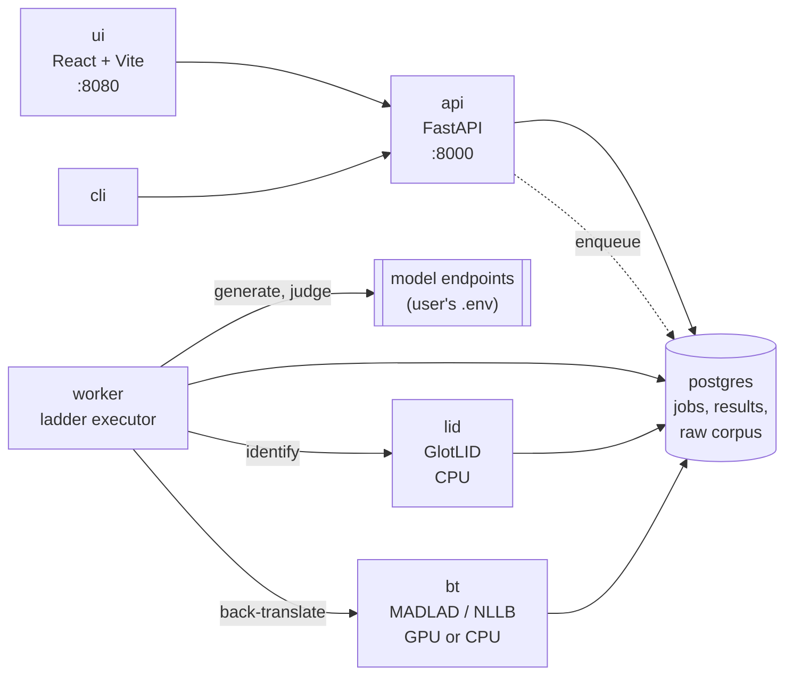
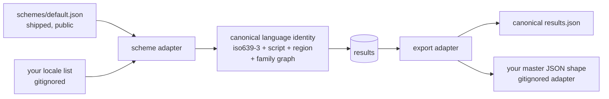

# 03 — Architecture and development stages (Stage 3)

Date: 2026-09-15
Status: proposal for review. No code written yet.
Depends on: `01 - Initial discussion - stage 1.md` (methodology, output contract, dialect logic), `02 - Experiment - invented language control.md`.

---

## Summary

A single-tenant application the user runs themselves: `git clone`, fill `.env`, `docker compose up`, UI on `localhost`. Five services, one database, no hosted infrastructure, no key custody, no multi-tenancy.

The deployment pivot removed most of what made `Basic idea v0.md`'s architecture heavy. There is no queue contention, no abuse surface, no metering, no tenant isolation, and no autoscaling. What remains is a job runner with a GPU-bound component, and the architecture should say so rather than dress it up.

---

## What the pivot deleted

| In `Basic idea v0.md` | Status | Why |
|---|---|---|
| Kafka / RabbitMQ | **dropped** | One user, one job at a time. A Postgres job table with `SELECT … FOR UPDATE SKIP LOCKED` is the whole queue, and it is crash-safe and inspectable. |
| Redis | **dropped from v1** | The cache is the results table, which must be durable anyway. Redis would be a second source of truth for no gain. |
| Nginx / Caddy, HTTPS | **dropped** | localhost. TLS termination solves a problem we no longer have. |
| API-key entry UI, encryption at rest | **dropped** | Keys live in the user's own `.env` and never reach the application's storage. |
| Background queue for public submissions | **dropped** | No public submissions. |

Keeping these would be cargo cult. They can return the day someone genuinely hosts this, and the job table is a clean seam for that.

---

## Services

Five containers. The split is justified by **model lifetime and hardware affinity**, not by fashion: the two ML services load large models once and hold them, and exactly one of them wants the GPU.



| Service | Role | Hardware |
|---|---|---|
| `api` | REST: jobs, results, export/merge, scheme browse | CPU, trivial |
| `worker` | Executes the ladder; the only component that knows the method | CPU + network |
| `lid` | GlotLID language+script identification | CPU always, ~1.2 GB RAM |
| `bt` | Back-translation, and back-translator qualification | **GPU if available**, else CPU or remote |
| `ui` | SPA on localhost | — |
| `postgres` | All state, including the raw generation corpus | — |

`worker` calls `lid` and `bt` over HTTP rather than importing them, so the heavy models load once per container rather than once per job, and so a CPU-only machine can swap `bt` for a remote back-translator with no code change.

### Hardware profile detection

Resolved once at `bt` startup, overridable by `HARDWARE_PROFILE` in `.env`, and **recorded on every result**:

| Detected | Profile | Back-translator | Coverage |
|---|---|---|---|
| CUDA, VRAM ≥ 6 GB | `gpu-fp16` | MADLAD-400-3B-MT fp16 | ~400 languages |
| CUDA, VRAM 4–6 GB | `gpu-int8` | MADLAD-400-3B-MT int8 | ~400 languages |
| CUDA, VRAM < 4 GB, or none | `cpu` | NLLB-200-distilled-600M | ~200 languages |
| `BT_REMOTE_MODEL` set | `api` | A configured LLM | as qualified |

Verified reference machine: RTX 4060 Laptop 8 GB, Docker 27.5.1 with the `nvidia` runtime registered, `docker run --gpus all` confirmed working. That machine lands on `gpu-fp16`, marginally — `gpu-int8` is the safer default and should be what the autodetect picks at 8 GB.

`docker compose --profile gpu up` adds the device reservation; the default profile is CPU so that `docker compose up` works everywhere.

---

## Stack

Chosen for legibility and for being demonstrable in a portfolio, not for novelty.

| Layer | Choice | Note |
|---|---|---|
| Language | Python 3.12 | Same language as the ML components; one toolchain |
| API | FastAPI + Pydantic v2 | Schemas are the contract; OpenAPI docs come free |
| DB | PostgreSQL 16 + SQLAlchemy 2 + Alembic | JSONB for raw payloads, real columns for everything queried |
| Queue | Postgres table, `FOR UPDATE SKIP LOCKED` | Crash-safe, inspectable, no extra service |
| ML | PyTorch + HuggingFace `transformers`; `fasttext` for GlotLID | |
| UI | React + Vite + TypeScript | SPA per the original intent |
| Packaging | docker compose, `cpu` / `gpu` profiles | |
| Tests | pytest, with a recorded-response fixture set | Method changes must be testable without spending tokens |

The recorded-response fixtures matter more than they look: the 204 raw responses already captured in `experiments/results/` are the seed. Grading logic must be re-runnable offline, or every method change costs money and becomes untestable in CI.

---

## Data model

Ten tables. The two that carry the project's long-term value are `generation` (the raw corpus) and `result`.

| Table | Holds | Notes |
|---|---|---|
| `language` | The 602-tag scheme | Loaded from `languages.json`; `link` resolved to both tag keys and `lll` codes |
| `lang_class` | The 423 `(lll, script)` equivalence classes | Probe 3 runs per class, not per tag |
| `engine` | `mt.*` identifiers | Both MT engines and LLMs — one namespace, per the TMS |
| `marker_set` | Per-tag marker lists and elicitation contexts | `status`: `markers` / `not-distinguishable`; absent = `untested` |
| `job` | engine, tag list, method_version, backtranslator, judge, profile, status | Batch is the only mode |
| `job_item` | job × tag × rung × designator | The unit of work |
| `generation` | prompt, designator, raw output, tokens, latency | **Never deleted.** Re-gradable when the method changes |
| `lid_result` | language, script, confidence per generation | Feeds both the gate and `resolves_to` |
| `grade` | per-fact `present` / `missing` / `contradicted`, judge id | Blind; NLI cross-check stored alongside |
| `result` | per (tag, engine, method_version) | The publishable row — see below |
| `bt_qualification` | per (language, back-translator) pass/fail | Gates whether a low score is interpretable at all |

### The `result` row

```json
{
  "tag": "kk-latn",
  "engine": "mt.openai-gpt-4o",
  "tier": "Basic",
  "ci": [0.31, 0.58],
  "borderline": true,
  "evidence": "fact-recall",
  "provenance": "measured",
  "designator": { "winner": "Kazakh (Latin script)", "tried": ["...", "..."] },
  "variant_evidence": "proven",
  "resolves_to": null,
  "scores": { "s_lang": 0.92, "s_content": 0.44, "s_variant": 0.80 },
  "backtranslator": "madlad400-3b-mt@int8",
  "judge": "openai-gpt-4o",
  "hardware_profile": "gpu-int8",
  "method_version": "1.0.0",
  "tested_at": "2026-09-15T12:00:00Z"
}
```

A macrolanguage row carries `resolves_to` as a distribution (`{"kaz_Cyrl": 6, "kaz_Latn": 0}`) and `variant_evidence: null`.

### Export and merge

Two artifacts, as fixed in doc 01:

- `languages_llm_support.<engine>.json` — the master's exact shape, `{ "<key>": { "mt.<engine>": "<designator>" } }`, mergeable.
- `results/<engine>/<method_version>.json` — full evidence, never merged.

Merge is a **per-key, per-engine upsert**. A key absent from run output never means delete. Conflict rule: higher `method_version` wins, then newer `tested_at`. Implemented as a pure function over two JSON documents with its own test suite — it is the one place where a bug silently destroys the TMS's data.

---

## Cost and time per full scan

Per model, 602 tags via 423 classes, on the adaptive ladder:

| Rung | Calls | Judge calls |
|---|---|---|
| 1 — designator sweep, gate-only | 423 × 3 items × ~2.5 designators ≈ 3,200 | 0 |
| 2 — fact recall on survivors | ~230 × 3 ≈ 700 | ~700 |
| 3 — borderline widening | ~80 × 14 ≈ 1,100 | ~1,100 |
| 4 — dialect probes | 239 × 3 ≈ 700 | 0 (script/marker scored locally) |
| **Total** | **≈ 5,700** | **≈ 1,800** |

At roughly 150 output tokens per generation and 100 per judgment, that is ~1.0 M generation + ~0.2 M judge tokens. On a mid-tier model, single-digit dollars; on a frontier model, low tens. Back-translation is local and free on the GPU profile.

Wall clock is dominated by the endpoint, not by us: at 8 concurrent requests and ~1 s per call, roughly 15–20 minutes for a full scan. **Reasoning must be off** — doc 02 measured a 150× token difference and ~25× latency on one route.

### Overspend guards

Single-tenant removes the abuse case but not the accident case:

- `--dry-run` prints the full call plan and an estimate before spending anything.
- A per-job `max_calls` and `max_tokens` budget, enforced in `worker`, job fails closed.
- Every rung is resumable — a killed job restarts from `job_item`, never from zero.
- Results are cached on `(engine, tag, method_version, backtranslator)`; re-running a scan costs nothing for unchanged rows.

---

## Development stages

Each stage ends in something demonstrable. Review between stages.

| # | Stage | Done when |
|---|---|---|
| **S0** | Skeleton: compose, Postgres, Alembic, scheme loader, hardware detect | `docker compose up` runs; `GET /languages` returns 602 tags with classes and family links resolved |
| **S1** | **Thin vertical slice, one language, CLI only** | `check --engine mt.openai-gpt-4o --tag cv` runs generate → LID gate → back-translate → judge → tier, and writes both artifacts. Every later stage widens this path; none replaces it |
| **S2** | The ladder: class collapse, designator selection, pruning, adaptive rungs | A 20-language batch runs end to end with per-class economics visible in the log |
| **S3** | Back-translator qualification + evidence classes | Every result carries an honest `evidence`; languages the instrument cannot read report `unverified` rather than a bad score |
| **S4** | Persistence, job API, merge/upsert, staleness view | A full 602-tag scan runs, resumes after a kill, and merges into a copy of the master file without touching other engines |
| **S5** | UI | Pick engine, pick languages or "all", watch progress, browse results with intervals and evidence, download artifacts |
| **S6** | Dialects: marker files, script-split scoring, `variant_evidence` | `en-AU` proven from a marker list; `ru-BY` correctly `not-distinguishable`; `kk-Latn` scored by script |
| **S7** | **Calibration study** — fact-recall vs chrF++ against FLORES+ on ~200 languages | Published error bars for the proxy metric. The strongest artifact in the project |
| **S8** | README, methodology page, limitations | A reader can reproduce a result and knows exactly what it does not mean |

S1 is the one that matters. A working end-to-end path for a single language, however crude, de-risks every assumption in doc 01 — and the temptation to build S2–S4 first should be resisted.

---

## Open question raised by S0

**Should the shipped catalogue offer named subsets?** All 9,589 tags is the right *catalogue* but the wrong *default job*. Candidate subsets: `flores200` (so the S7 calibration study has a natural target), `cldr-core`, `top-100-by-speakers`, `living-only`. A user's own locale list remains the other path. Deciding this affects the UI's default view at S3 and what `check --all` means.

## Decisions taken 2026-09-15

1. **UI comes early.** Needed for manual testing, so it is pulled forward from S5 to a thin read-only view at S3, widened at S5. Not a blocker for the pipeline stages.
2. **Judge defaults to `gpt-4o-mini`, and is configurable.** The judge only does pivot-language reading comprehension, so a small model should suffice; S3's injected controls will confirm it. Model configuration lives in a gitignored `models.yaml` (it references endpoints and credentials); `models.example.yaml` ships. Where practical, `models.yaml` should name *environment variables* rather than inline secrets, so the file itself stays shareable.
3. **`experiments/results/` is committed.** The raw responses are the artifact that makes the claims in doc 02 checkable. Removed from `.gitignore`.
4. **The language scheme is decoupled from any one system's tag convention.** See below. `languages/` is now gitignored — the internal Logrus scheme stays on disk as a local example but is no longer tracked.

## The scheme adapter

The application's core must not assume the Logrus tag convention. Its internal identity for a language is canonical — roughly `(iso639_3, script, region)` — and every external locale list reaches it through an adapter.



**Shipped with the repo — `schemes/default.json`**, generated from public sources:

| Source | Provides | License |
|---|---|---|
| ISO 639-3 tables (SIL) | language codes, **the official macrolanguage mapping** — which yields the `inclusive` / `link` family structure for free | free with attribution |
| CLDR `likelySubtags` (Unicode) | default script and region per language | Unicode license, permissive |
| Glottolog (optional) | family relations, for the nearest-relative confusion check | CC BY |

**Not shipped:** any organisation's own locale list, and the adapter that reshapes results into its master file. Both are gitignored. The Logrus TMS becomes simply the first adapter, not a hardcoded assumption.

Consequence for the output contract: the core emits results keyed by canonical identity. `languages_llm_support.<engine>.json` in the Logrus shape is produced by the Logrus **export adapter**, not by the core. The merge semantics from doc 01 (per-key per-engine upsert, absent never means delete, `method_version` then `tested_at`) belong to that adapter.

This is also what makes the README's promise real: anyone brings their own locale list and gets results keyed to their own tags.

### Revised stage table

S0 gains the scheme adapter and template generation; the UI moves earlier.

| # | Stage | Done when |
|---|---|---|
| **S0** ✅ | Skeleton: compose, Postgres, hardware detect, **scheme adapter + generated `schemes/default.json`** | **Done 2026-09-15** — `docker compose up` runs; `GET /languages` returns 9,589 tags with family links resolved, from the shipped catalogue or a user-supplied list |
| **S1** | **Thin vertical slice, one language, CLI only** | `check --engine mt.openai-gpt-4o --tag cv` runs generate → LID gate → back-translate → judge → tier, and writes both artifacts |
| **S2** | The ladder: class collapse, designator selection, pruning, adaptive rungs | A 20-language batch runs end to end with per-class economics visible |
| **S3** | Back-translator qualification, evidence classes, **thin read-only UI** | Every result carries an honest `evidence`; results browsable in a browser |
| **S4** | Persistence, job API, export adapters, staleness view | A full scan runs, resumes after a kill, and merges into a copy of a master file without touching other engines |
| **S5** | Full UI | Pick engine and languages, trigger jobs, watch progress, download artifacts |
| **S6** | Dialects: marker files, script-split scoring, `variant_evidence` | `en-AU` proven from markers; `ru-BY` `not-distinguishable`; `kk-Latn` scored by script |
| **S7** | **Calibration study** — fact-recall vs chrF++ against FLORES+ | Published error bars for the proxy metric |
| **S8** | README, methodology page, limitations | A reader can reproduce a result and knows what it does not mean |
| **S9** | **Public landing page** | The project is explicable to someone who has never run it |

S1 remains the stage that matters: a working end-to-end path for a single language de-risks every assumption in doc 01.

## S9 — landing page (planned)

A public page describing the project, added once the tool works and its results are proven. Deliberately last: a landing page for software that does not yet run is a liability.

**Purpose.** The tool is self-hosted, so the page is not a product front-end — nobody signs up for anything. It exists to explain the project to someone who has not cloned it: what question it answers, how, and — given the whole design rests on saying so — what the answers do not mean.

**Content, in rough priority order:**

1. The problem: vendor language lists are unfalsifiable, and for the long tail nothing is published at all.
2. The method in one diagram: content-controlled generation → local gate → back-translation → fact recall → graded tier.
3. **The limitations, prominently** — not in a footer. Heuristic, small samples, `unverified` where the instrument cannot read the language, and comparable only within one back-translator/judge/method version.
4. The evidence: the invented-language experiment (doc 02) and the S7 calibration study are the two things that make the method credible rather than merely plausible. Both are publishable as they stand.
5. How to run it, pointing at the README.
6. Attribution for ISO 639-3, SIL langtags, FLORES+.

**Form.** Static, no backend — GitHub Pages from `docs/` is the obvious host, since it costs nothing and keeps the page in the same repository as the thing it describes. It should also be the natural home for published result sets as they accumulate.

**Open:** whether the page hosts browsable results (which model supports which language, generated from real scans) or only describes the method. Results-on-the-page is the more useful artifact and the better portfolio piece, but it implies a publishing pipeline and a decision about which scans are canonical. Worth deciding at S7, when there are results worth publishing.

---

# Implementation log

## S0 — skeleton, scheme adapter, public catalogue (done 2026-09-15, commit `f22b5e1`)

**Built:** `src/llmlc/` with `scheme` (canonical model, loader, adapter protocol), `hardware` (profile detection), `config`, and a read-only FastAPI surface (`/health`, `/hardware`, `/scheme`, `/languages`, `/languages/{tag}`). `docker compose up` brings up Postgres and the API. 28 tests, none requiring network or GPU.

**The public catalogue works.** `schemes/default.json` — 9,589 tags, 185 macrolanguages, 8,314 living — generated from ISO 639-3 code tables, the official ISO 639-3 macrolanguage mapping, and SIL langtags. It is **committed** (3.4 MB), not generated on first run: "minutes from clone" is the product promise and requiring a network fetch at setup would break it. `--refresh` regenerates.

Note for whoever regenerates: **SIL moved the ISO 639-3 download URLs.** The working path is `iso639-3.sil.org/sites/iso639-3/files/downloads/…`, not `.../sites/default/files/downloads/…`, which now 404s. Recorded in the generator.

### Findings

**1. SIL langtags already resolves default scripts and regions.** `kk` → `kk-Cyrl-KZ`, `kk-AF` → `kk-Arab-AF`. So a standards-based default resolution exists independently of anything we measure.

That makes the per-model **observed** `resolves_to` more interesting, not less. *"The standard says `kk` means Cyrillic-Kazakhstan; this model actually produced X"* is a comparison worth publishing, and it is free — LID runs on every item anyway.

**2. Class collapse is scheme-dependent, and barely helps the public catalogue.** 9,589 tags collapse to only 9,103 classes, because langtags is a **language**-level catalogue while the Logrus scheme is **locale**-level (602 tags → 423 classes). Largest classes in the default catalogue: `en|Latn` (97), `fr|Latn` (27), `ar|Arab` (26), `es|Latn` (25).

Consequence for the cost model in this document: **the ~5,700-call estimate is for a locale-level scheme of roughly 600 tags.** A full run over all 9,589 default-catalogue tags is a much larger job and should not be the default action. This raises a new question — see open questions below.

**3. Hardware detection behaves as intended on the reference machine.** Host: `gpu-int8`, RTX 4060 Laptop, 8188 MiB, MADLAD-400-3B. Inside the `api` container: `cpu`, correctly, since no GPU is passed through to it. Detection becomes authoritative in the `bt` service at S3; until then `/hardware` reports what the calling process can see, which is worth knowing when reading it from inside Docker.

### Deviations from the plan

| Planned | Actual | Why |
|---|---|---|
| Alembic at S0 | **Deferred to S4** | There is no schema yet. Scaffolding migrations over an empty model is ceremony; S4 introduces persistence and will introduce Alembic with a real baseline. |
| `schemes/default.json` generated locally | **Committed** | Clone-to-run must not require a network fetch. |
| Hardware detection in `api` | Library-level, reported by `api` | Becomes authoritative in `bt` at S3. |

---

# S1 — thin vertical slice (next)

**Goal:** one language, end to end, CLI only. `llmlc check --engine <model> --tag cv` runs the full path and writes both artifacts. Crude is fine; complete is not optional. Every later stage widens this path rather than replacing it.

This is the stage that de-risks doc 01, because it is the first time the method runs as a whole rather than as an argument.

## Path to implement

```
scheme lookup  ->  designator  ->  generate  ->  gate  ->  back-translate  ->  judge  ->  tier  ->  artifacts
```

| Step | Component | S1 scope |
|---|---|---|
| Designator | `probe/designator.py` | Build candidates A–E from the scheme entry (name+region, endonym, tag, ISO 639-3 + script, incumbent). S1 uses candidate A only; the sweep is S2. |
| Generate | `client/openai.py` | OpenAI-compatible call. **Reasoning off**, with the per-model fallback proven in doc 02. Content-controlled prompt from a fact spec. |
| Gate | `probe/gate.py` | Refusal, copy, script block, degeneration, memorised boilerplate. GlotLID lands here; S1 may start with script+heuristics and add GlotLID within the stage. |
| Back-translate | `bt/` | S1 uses the **`api` profile** — a pinned aggregator model, different vendor from the model under test. Local MADLAD is S3. |
| Judge | `probe/judge.py` | Blind, pivot-only, three-valued per fact (`present` / `missing` / `contradicted`), JSON out, `gpt-4o-mini` default. |
| Tier | `probe/score.py` | `S_lang`, `S_content`, tier thresholds, bootstrap CI, `borderline` when the interval straddles a boundary. |
| Artifacts | `export/` | Minimal mergeable JSON + full-evidence record. |

## Fact specs

S1 needs a small set of content specifications — scenario prose plus the fact checklist that grades it. Three to five, hand-written, stored as data (`data/specs/*.json`) rather than embedded in code, since S2 will need many more and S7 will re-grade old generations against them.

## Definition of done

- `llmlc check --engine openai-gpt-4o --tag cv` produces a tier, an interval, an evidence class, and both artifacts.
- The same command on a language the model cannot write produces `None` with a `deterministic-negative` evidence class and **no judge call**.
- Every model call is recorded to disk with its prompt, designator and token usage — the raw corpus starts here, since S7 re-grades it.
- Grading is testable offline against recorded fixtures, with no network. The 204 responses already in `experiments/results/` seed this.
- Tests cover the gate and the scorer without touching an API.

## Open questions for S1

1. **Pivot language** — English by default. Worth a flag now, since doc 01 proposes closer pivots (Russian for Turkic, Arabic for Semitic) and the plumbing is cheaper to add than to retrofit.
2. **Back-translator for S1** — which aggregator model? It must differ from the model under test. `gemini-gemini-3-8-flash` is the obvious pick against an OpenAI model under test.
