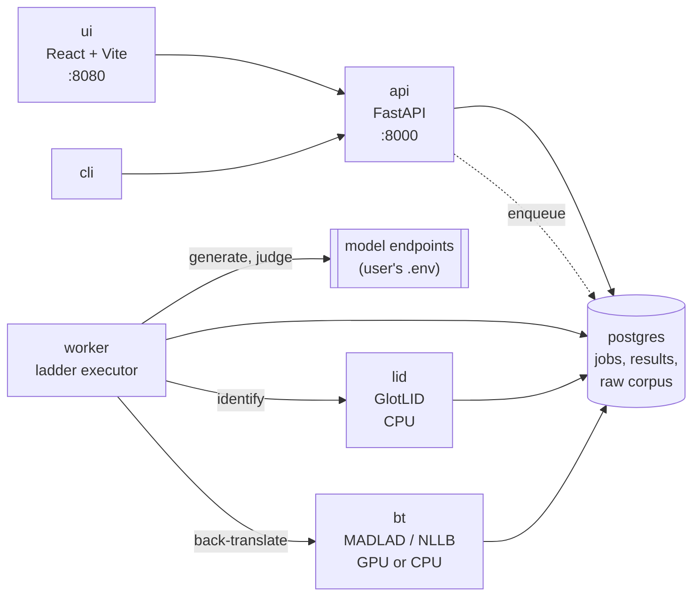
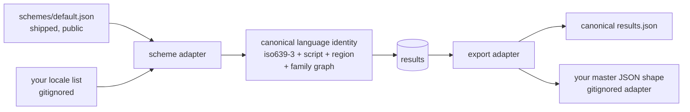

# 03 — Architecture and development stages (Stage 3)

Date: 2026-09-15
Status: proposal for review. No code written yet.
Depends on: `01 - Initial discussion - stage 1.md` (methodology, output contract, dialect logic), `02 - Experiment - invented language control.md`.

---

## Summary

A single-tenant application the user runs themselves: `git clone`, fill `.env`, `docker compose up`, UI on `localhost`. Five services, one database, no hosted infrastructure, no key custody, no multi-tenancy.

The deployment pivot removed most of what made `Basic idea v0.md`'s architecture heavy. There is no queue contention, no abuse surface, no metering, no tenant isolation, and no autoscaling. What remains is a job runner with a GPU-bound component, and the architecture should say so rather than dress it up.

---

## What the pivot deleted

| In `Basic idea v0.md` | Status | Why |
|---|---|---|
| Kafka / RabbitMQ | **dropped** | One user, one job at a time. A Postgres job table with `SELECT … FOR UPDATE SKIP LOCKED` is the whole queue, and it is crash-safe and inspectable. |
| Redis | **dropped from v1** | The cache is the results table, which must be durable anyway. Redis would be a second source of truth for no gain. |
| Nginx / Caddy, HTTPS | **dropped** | localhost. TLS termination solves a problem we no longer have. |
| API-key entry UI, encryption at rest | **dropped** | Keys live in the user's own `.env` and never reach the application's storage. |
| Background queue for public submissions | **dropped** | No public submissions. |

Keeping these would be cargo cult. They can return the day someone genuinely hosts this, and the job table is a clean seam for that.

---

## Services

Five containers. The split is justified by **model lifetime and hardware affinity**, not by fashion: the two ML services load large models once and hold them, and exactly one of them wants the GPU.



| Service | Role | Hardware |
|---|---|---|
| `api` | REST: jobs, results, export/merge, scheme browse | CPU, trivial |
| `worker` | Executes the ladder; the only component that knows the method | CPU + network |
| `lid` | GlotLID language+script identification | CPU always, ~1.2 GB RAM |
| `bt` | Back-translation, and back-translator qualification | **GPU if available**, else CPU or remote |
| `ui` | SPA on localhost | — |
| `postgres` | All state, including the raw generation corpus | — |

`worker` calls `lid` and `bt` over HTTP rather than importing them, so the heavy models load once per container rather than once per job, and so a CPU-only machine can swap `bt` for a remote back-translator with no code change.

### Hardware profile detection

Resolved once at `bt` startup, overridable by `HARDWARE_PROFILE` in `.env`, and **recorded on every result**:

| Detected | Profile | Back-translator | Coverage |
|---|---|---|---|
| CUDA, VRAM ≥ 6 GB | `gpu-fp16` | MADLAD-400-3B-MT fp16 | ~400 languages |
| CUDA, VRAM 4–6 GB | `gpu-int8` | MADLAD-400-3B-MT int8 | ~400 languages |
| CUDA, VRAM < 4 GB, or none | `cpu` | NLLB-200-distilled-600M | ~200 languages |
| `BT_REMOTE_MODEL` set | `api` | A configured LLM | as qualified |

Verified reference machine: RTX 4060 Laptop 8 GB, Docker 27.5.1 with the `nvidia` runtime registered, `docker run --gpus all` confirmed working. That machine lands on `gpu-fp16`, marginally — `gpu-int8` is the safer default and should be what the autodetect picks at 8 GB.

`docker compose --profile gpu up` adds the device reservation; the default profile is CPU so that `docker compose up` works everywhere.

---

## Stack

Chosen for legibility and for being demonstrable in a portfolio, not for novelty.

| Layer | Choice | Note |
|---|---|---|
| Language | Python 3.12 | Same language as the ML components; one toolchain |
| API | FastAPI + Pydantic v2 | Schemas are the contract; OpenAPI docs come free |
| DB | PostgreSQL 16 + SQLAlchemy 2 + Alembic | JSONB for raw payloads, real columns for everything queried |
| Queue | Postgres table, `FOR UPDATE SKIP LOCKED` | Crash-safe, inspectable, no extra service |
| ML | PyTorch + HuggingFace `transformers`; `fasttext` for GlotLID | |
| UI | React + Vite + TypeScript | SPA per the original intent |
| Packaging | docker compose, `cpu` / `gpu` profiles | |
| Tests | pytest, with a recorded-response fixture set | Method changes must be testable without spending tokens |

The recorded-response fixtures matter more than they look: the 204 raw responses already captured in `experiments/results/` are the seed. Grading logic must be re-runnable offline, or every method change costs money and becomes untestable in CI.

---

## Data model

Ten tables. The two that carry the project's long-term value are `generation` (the raw corpus) and `result`.

| Table | Holds | Notes |
|---|---|---|
| `language` | The 602-tag scheme | Loaded from `languages.json`; `link` resolved to both tag keys and `lll` codes |
| `lang_class` | The 423 `(lll, script)` equivalence classes | Probe 3 runs per class, not per tag |
| `engine` | `mt.*` identifiers | Both MT engines and LLMs — one namespace, per the TMS |
| `marker_set` | Per-tag marker lists and elicitation contexts | `status`: `markers` / `not-distinguishable`; absent = `untested` |
| `job` | engine, tag list, method_version, backtranslator, judge, profile, status | Batch is the only mode |
| `job_item` | job × tag × rung × designator | The unit of work |
| `generation` | prompt, designator, raw output, tokens, latency | **Never deleted.** Re-gradable when the method changes |
| `lid_result` | language, script, confidence per generation | Feeds both the gate and `resolves_to` |
| `grade` | per-fact `present` / `missing` / `contradicted`, judge id | Blind; NLI cross-check stored alongside |
| `result` | per (tag, engine, method_version) | The publishable row — see below |
| `bt_qualification` | per (language, back-translator) pass/fail | Gates whether a low score is interpretable at all |

### The `result` row

```json
{
  "tag": "kk-latn",
  "engine": "mt.openai-gpt-4o",
  "tier": "Basic",
  "ci": [0.31, 0.58],
  "borderline": true,
  "evidence": "fact-recall",
  "provenance": "measured",
  "designator": { "winner": "Kazakh (Latin script)", "tried": ["...", "..."] },
  "variant_evidence": "proven",
  "resolves_to": null,
  "scores": { "s_lang": 0.92, "s_content": 0.44, "s_variant": 0.80 },
  "backtranslator": "madlad400-3b-mt@int8",
  "judge": "openai-gpt-4o",
  "hardware_profile": "gpu-int8",
  "method_version": "1.0.0",
  "tested_at": "2026-09-15T12:00:00Z"
}
```

A macrolanguage row carries `resolves_to` as a distribution (`{"kaz_Cyrl": 6, "kaz_Latn": 0}`) and `variant_evidence: null`.

### Export and merge

Two artifacts, as fixed in doc 01:

- `languages_llm_support.<engine>.json` — the master's exact shape, `{ "<key>": { "mt.<engine>": "<designator>" } }`, mergeable.
- `results/<engine>/<method_version>.json` — full evidence, never merged.

Merge is a **per-key, per-engine upsert**. A key absent from run output never means delete. Conflict rule: higher `method_version` wins, then newer `tested_at`. Implemented as a pure function over two JSON documents with its own test suite — it is the one place where a bug silently destroys the TMS's data.

---

## Cost and time per full scan

Per model, 602 tags via 423 classes, on the adaptive ladder:

| Rung | Calls | Judge calls |
|---|---|---|
| 1 — designator sweep, gate-only | 423 × 3 items × ~2.5 designators ≈ 3,200 | 0 |
| 2 — fact recall on survivors | ~230 × 3 ≈ 700 | ~700 |
| 3 — borderline widening | ~80 × 14 ≈ 1,100 | ~1,100 |
| 4 — dialect probes | 239 × 3 ≈ 700 | 0 (script/marker scored locally) |
| **Total** | **≈ 5,700** | **≈ 1,800** |

At roughly 150 output tokens per generation and 100 per judgment, that is ~1.0 M generation + ~0.2 M judge tokens. On a mid-tier model, single-digit dollars; on a frontier model, low tens. Back-translation is local and free on the GPU profile.

Wall clock is dominated by the endpoint, not by us: at 8 concurrent requests and ~1 s per call, roughly 15–20 minutes for a full scan. **Reasoning must be off** — doc 02 measured a 150× token difference and ~25× latency on one route.

### Overspend guards

Single-tenant removes the abuse case but not the accident case:

- `--dry-run` prints the full call plan and an estimate before spending anything.
- A per-job `max_calls` and `max_tokens` budget, enforced in `worker`, job fails closed.
- Every rung is resumable — a killed job restarts from `job_item`, never from zero.
- Results are cached on `(engine, tag, method_version, backtranslator)`; re-running a scan costs nothing for unchanged rows.

---

## Development stages

Each stage ends in something demonstrable. Review between stages.

| # | Stage | Done when |
|---|---|---|
| **S0** | Skeleton: compose, Postgres, Alembic, scheme loader, hardware detect | `docker compose up` runs; `GET /languages` returns 602 tags with classes and family links resolved |
| **S1** | **Thin vertical slice, one language, CLI only** | `check --engine mt.openai-gpt-4o --tag cv` runs generate → LID gate → back-translate → judge → tier, and writes both artifacts. Every later stage widens this path; none replaces it |
| **S2** | The ladder: class collapse, designator selection, pruning, adaptive rungs | A 20-language batch runs end to end with per-class economics visible in the log |
| **S3** | Back-translator qualification + evidence classes | Every result carries an honest `evidence`; languages the instrument cannot read report `unverified` rather than a bad score |
| **S4** | Persistence, job API, merge/upsert, staleness view | A full 602-tag scan runs, resumes after a kill, and merges into a copy of the master file without touching other engines |
| **S5** | UI | Pick engine, pick languages or "all", watch progress, browse results with intervals and evidence, download artifacts |
| **S6** | Dialects: marker files, script-split scoring, `variant_evidence` | `en-AU` proven from a marker list; `ru-BY` correctly `not-distinguishable`; `kk-Latn` scored by script |
| **S7** | **Calibration study** — fact-recall vs chrF++ against FLORES+ on ~200 languages | Published error bars for the proxy metric. The strongest artifact in the project |
| **S8** | README, methodology page, limitations | A reader can reproduce a result and knows exactly what it does not mean |

S1 is the one that matters. A working end-to-end path for a single language, however crude, de-risks every assumption in doc 01 — and the temptation to build S2–S4 first should be resisted.

---

## Open question raised by S0

**Should the shipped catalogue offer named subsets?** All 9,589 tags is the right *catalogue* but the wrong *default job*. Candidate subsets: `flores200` (so the S7 calibration study has a natural target), `cldr-core`, `top-100-by-speakers`, `living-only`. A user's own locale list remains the other path. Deciding this affects the UI's default view at S3 and what `check --all` means.

## Decisions taken 2026-09-15

1. **UI comes early.** Needed for manual testing, so it is pulled forward from S5 to a thin read-only view at S3, widened at S5. Not a blocker for the pipeline stages.
2. **Judge defaults to `gpt-4o-mini`, and is configurable.** The judge only does pivot-language reading comprehension, so a small model should suffice; S3's injected controls will confirm it. Model configuration lives in a gitignored `models.yaml` (it references endpoints and credentials); `models.example.yaml` ships. Where practical, `models.yaml` should name *environment variables* rather than inline secrets, so the file itself stays shareable.
3. **`experiments/results/` is committed.** The raw responses are the artifact that makes the claims in doc 02 checkable. Removed from `.gitignore`.
4. **The language scheme is decoupled from any one system's tag convention.** See below. `languages/` is now gitignored — the internal Logrus scheme stays on disk as a local example but is no longer tracked.

## The scheme adapter

The application's core must not assume the Logrus tag convention. Its internal identity for a language is canonical — roughly `(iso639_3, script, region)` — and every external locale list reaches it through an adapter.



**Shipped with the repo — `schemes/default.json`**, generated from public sources:

| Source | Provides | License |
|---|---|---|
| ISO 639-3 tables (SIL) | language codes, **the official macrolanguage mapping** — which yields the `inclusive` / `link` family structure for free | free with attribution |
| CLDR `likelySubtags` (Unicode) | default script and region per language | Unicode license, permissive |
| Glottolog (optional) | family relations, for the nearest-relative confusion check | CC BY |

**Not shipped:** any organisation's own locale list, and the adapter that reshapes results into its master file. Both are gitignored. The Logrus TMS becomes simply the first adapter, not a hardcoded assumption.

Consequence for the output contract: the core emits results keyed by canonical identity. `languages_llm_support.<engine>.json` in the Logrus shape is produced by the Logrus **export adapter**, not by the core. The merge semantics from doc 01 (per-key per-engine upsert, absent never means delete, `method_version` then `tested_at`) belong to that adapter.

This is also what makes the README's promise real: anyone brings their own locale list and gets results keyed to their own tags.

### Revised stage table

S0 gains the scheme adapter and template generation; the UI moves earlier.

| # | Stage | Done when |
|---|---|---|
| **S0** ✅ | Skeleton: compose, Postgres, hardware detect, **scheme adapter + generated `schemes/default.json`** | **Done 2026-09-15** — `docker compose up` runs; `GET /languages` returns 9,589 tags with family links resolved, from the shipped catalogue or a user-supplied list |
| **S1** ✅ | **Thin vertical slice, one language, CLI only** | **Done 2026-09-16** — `llmlc check --tag cv --engine <model>` runs the full path and writes both artifacts |
| **S2** ✅ | **Trustworthy coverage:** FLORES+ controls, qualification cache, per-language back-translator routing, `gold-reference` evidence | **Done 2026-09-16** — a 20-language spread returned 20/20 real evidence, 0 `unverified` |
| **S3** ✅ | The ladder: designator sweep, class collapse, pruning, adaptive rungs, batch mode, **thin read-only UI** | **Done 2026-09-17** — 18 tags in 165 calls (9.2/tag); results browsable at `/` |
| **S4** ✅ | Persistence, job API, export adapters, staleness view | **Done 2026-09-17** — results in SQLite/Postgres, `llmlc status`, `llmlc export --merge-into` verified non-destructive |
| **S5** | Full UI | Pick engine and languages, trigger jobs, watch progress, download artifacts |
| **S6** | Dialects: marker files, script-split scoring, `variant_evidence` | `en-AU` proven from markers; `ru-BY` `not-distinguishable`; `kk-Latn` scored by script |
| **S7** | **Calibration study** — fact-recall vs chrF++ against FLORES+ | Published error bars for the proxy metric |
| **S8** | README, methodology page, limitations | A reader can reproduce a result and knows what it does not mean |
| **S9** | **Public landing page** | The project is explicable to someone who has never run it |

S1 remains the stage that matters: a working end-to-end path for a single language de-risks every assumption in doc 01.

## S9 — landing page (planned)

A public page describing the project, added once the tool works and its results are proven. Deliberately last: a landing page for software that does not yet run is a liability.

**Purpose.** The page is **Andrei's personal portfolio piece** (decided 2026-09-16). The tool is self-hosted, so it is not a product front-end — nobody signs up for anything. It exists to show the work to someone who has not cloned it: what question it answers, how, what the answers do not mean, and what was actually found. Richer is better; depth is the point.

**Content, in rough priority order:**

1. The problem: vendor language lists are unfalsifiable, and for the long tail nothing is published at all.
2. The method in one diagram: content-controlled generation → local gate → back-translation → fact recall → graded tier.
3. **The limitations, prominently** — not in a footer. Heuristic, small samples, `unverified` where the instrument cannot read the language, and comparable only within one back-translator/judge/method version.
4. The evidence: the invented-language experiment (doc 02) and the S7 calibration study are the two things that make the method credible rather than merely plausible. Both are publishable as they stand.
5. How to run it, pointing at the README.
6. Attribution for ISO 639-3, SIL langtags, FLORES+.

**Form.** Static, no backend — GitHub Pages from `docs/` is the obvious host, since it costs nothing and keeps the page in the same repository as the thing it describes. It should also be the natural home for published result sets as they accumulate.

**Decided 2026-09-16: the page publishes browsable results**, not only the method. Which model supports which language, from real scans, with tiers, intervals and evidence classes visible. That implies a small publishing pipeline and a decision about which scans are canonical — both worth the cost, because a page that *shows measurements nobody else has* is a far stronger portfolio piece than one describing a method.

Content that earns its place on a portfolio page, beyond the basics:

- **The comparison table nobody else publishes:** N models × the supported-language counts each actually demonstrates, versus what each vendor claims.
- **The invented-language experiment** (doc 02) as an interactive exhibit — the verbatim fabrications are more persuasive than any summary of them.
- **`resolves_to` across macrolanguages:** what each model defaults to for `ar`, `zh`, `en`, `kk`, against what the standard says. Free from the scan, and genuinely novel.
- **The calibration study** (S7): fact-recall versus chrF++ with published error bars — the piece that shows the method was validated, not merely asserted.
- **Disagreements between models** on the same language: where one writes fluently and another refuses.

**Open:** which scans become canonical, and how often they are refreshed as models change.

---

# Implementation log

Every test run against a live model or a new dependency is written up in
`experiments/protocols/` — hypothesis, what was tested, what was used, results
including the inconvenient ones, conclusions with their limits, and how the
project changed. The log below summarises; the protocols are the record.


## S0 — skeleton, scheme adapter, public catalogue (done 2026-09-15, commit `f22b5e1`)

**Built:** `src/llmlc/` with `scheme` (canonical model, loader, adapter protocol), `hardware` (profile detection), `config`, and a read-only FastAPI surface (`/health`, `/hardware`, `/scheme`, `/languages`, `/languages/{tag}`). `docker compose up` brings up Postgres and the API. 28 tests, none requiring network or GPU.

**The public catalogue works.** `schemes/default.json` — 9,589 tags, 185 macrolanguages, 8,314 living — generated from ISO 639-3 code tables, the official ISO 639-3 macrolanguage mapping, and SIL langtags. It is **committed** (3.4 MB), not generated on first run: "minutes from clone" is the product promise and requiring a network fetch at setup would break it. `--refresh` regenerates.

Note for whoever regenerates: **SIL moved the ISO 639-3 download URLs.** The working path is `iso639-3.sil.org/sites/iso639-3/files/downloads/…`, not `.../sites/default/files/downloads/…`, which now 404s. Recorded in the generator.

### Findings

**1. SIL langtags already resolves default scripts and regions.** `kk` → `kk-Cyrl-KZ`, `kk-AF` → `kk-Arab-AF`. So a standards-based default resolution exists independently of anything we measure.

That makes the per-model **observed** `resolves_to` more interesting, not less. *"The standard says `kk` means Cyrillic-Kazakhstan; this model actually produced X"* is a comparison worth publishing, and it is free — LID runs on every item anyway.

**2. Class collapse is scheme-dependent, and barely helps the public catalogue.** 9,589 tags collapse to only 9,103 classes, because langtags is a **language**-level catalogue while the Logrus scheme is **locale**-level (602 tags → 423 classes). Largest classes in the default catalogue: `en|Latn` (97), `fr|Latn` (27), `ar|Arab` (26), `es|Latn` (25).

Consequence for the cost model in this document: **the ~5,700-call estimate is for a locale-level scheme of roughly 600 tags.** A full run over all 9,589 default-catalogue tags is a much larger job and should not be the default action. This raises a new question — see open questions below.

**3. Hardware detection behaves as intended on the reference machine.** Host: `gpu-int8`, RTX 4060 Laptop, 8188 MiB, MADLAD-400-3B. Inside the `api` container: `cpu`, correctly, since no GPU is passed through to it. Detection becomes authoritative in the `bt` service at S3; until then `/hardware` reports what the calling process can see, which is worth knowing when reading it from inside Docker.

### Deviations from the plan

| Planned | Actual | Why |
|---|---|---|
| Alembic at S0 | **Deferred to S4** | There is no schema yet. Scaffolding migrations over an empty model is ceremony; S4 introduces persistence and will introduce Alembic with a real baseline. |
| `schemes/default.json` generated locally | **Committed** | Clone-to-run must not require a network fetch. |
| Hardware detection in `api` | Library-level, reported by `api` | Becomes authoritative in `bt` at S3. |

---

# S1 — thin vertical slice (next)

**Goal:** one language, end to end, CLI only. `llmlc check --engine <model> --tag cv` runs the full path and writes both artifacts. Crude is fine; complete is not optional. Every later stage widens this path rather than replacing it.

This is the stage that de-risks doc 01, because it is the first time the method runs as a whole rather than as an argument.

## Path to implement

```
scheme lookup  ->  designator  ->  generate  ->  gate  ->  back-translate  ->  judge  ->  tier  ->  artifacts
```

| Step | Component | S1 scope |
|---|---|---|
| Designator | `probe/designator.py` | Build candidates A–E from the scheme entry (name+region, endonym, tag, ISO 639-3 + script, incumbent). S1 uses candidate A only; the sweep is S2. |
| Generate | `client/openai.py` | OpenAI-compatible call. **Reasoning off**, with the per-model fallback proven in doc 02. Content-controlled prompt from a fact spec. |
| Gate | `probe/gate.py` | Refusal, copy, script block, degeneration, memorised boilerplate. GlotLID lands here; S1 may start with script+heuristics and add GlotLID within the stage. |
| Back-translate | `bt/` | S1 uses the **`api` profile** — a pinned aggregator model, different vendor from the model under test. Local MADLAD is S3. |
| Judge | `probe/judge.py` | Blind, pivot-only, three-valued per fact (`present` / `missing` / `contradicted`), JSON out, `gpt-4o-mini` default. |
| Tier | `probe/score.py` | `S_lang`, `S_content`, tier thresholds, bootstrap CI, `borderline` when the interval straddles a boundary. |
| Artifacts | `export/` | Minimal mergeable JSON + full-evidence record. |

## Fact specs

S1 needs a small set of content specifications — scenario prose plus the fact checklist that grades it. Three to five, hand-written, stored as data (`data/specs/*.json`) rather than embedded in code, since S2 will need many more and S7 will re-grade old generations against them.

## Definition of done

- `llmlc check --engine openai-gpt-4o --tag cv` produces a tier, an interval, an evidence class, and both artifacts.
- The same command on a language the model cannot write produces `None` with a `deterministic-negative` evidence class and **no judge call**.
- Every model call is recorded to disk with its prompt, designator and token usage — the raw corpus starts here, since S7 re-grades it.
- Grading is testable offline against recorded fixtures, with no network. The 204 responses already in `experiments/results/` seed this.
- Tests cover the gate and the scorer without touching an API.

## Open questions for S1

Both resolved 2026-09-16:

1. **Pivot language: English**, exposed as `--pivot` from the start so closer pivots (Russian for Turkic, Arabic for Semitic) need no retrofit.
2. **S1 back-translator: `gemini-gemini-3-8-flash`** via the `api` profile — a different vendor from the OpenAI models under test, which satisfies the independence rule in doc 01.

## S1 — thin vertical slice (done 2026-09-16)

**Built:** `client` (OpenAI-compatible, reasoning off with per-model fallback), `probe/` (specs, designator, LID, gate, judge, score, corpus, pipeline), `bt/` (remote back-translator + qualification), `export/` (both artifacts + merge), and the `llmlc` CLI. 70 tests, none requiring network or GPU.

GlotLID is wired in — 2,102 language-script labels, CPU, 1.6 GB model, downloaded separately and absent-tolerant (the gate degrades to a script-only check and says so).

### The finding that changed the code

The first real run produced a **wrong answer**, and it was the failure doc 01 predicted.

Gemini writes correct Chuvash. Asked for the bus/rain/office scenario it produced *"Пӗр хӗрарӑм ирхи автобуса ӗлкӗреймерӗ. Вӑл ҫумӑр айӗнче ӗҫе ҫуран кайрӗ."* — an accurate rendering. But `gpt-4o`, used as the back-translator, rendered it as *"The sun rises in the east. Its light spreads across the sky."* The pipeline scored Gemini `Token` (0.13).

A control test settled it. Given Chuvash whose meaning we already knew:

| Back-translator | Output for *"I know Chuvash. The weather is very good today."* |
|---|---|
| `gpt-4o` | *"A man is walking. He is wearing a white shirt."* — fabricated |
| `deepseek-v4-pro` | *"I know Chuvash. The weather is very nice today."* — correct |
| `gemini-3-8-flash` | *"I know Chuvash. Today the weather is very nice."* — correct |
| `anthropic-claude-sonnet-4` | HTTP 404 — not actually available on the aggregator |

With a qualified back-translator, the same Gemini output scores **`Strong` (0.93)**. The verdict moved two tiers on the instrument alone.

**Consequence, and a correction to docs/01:** a model that cannot read a language does not refuse, it invents. Reading failures are therefore *more* dangerous than writing failures — writing failures are visible and caught free by the gate; reading failures are silent and corrupt the score of a model that did nothing wrong. **Back-translator qualification was pulled forward from S3 into S1** and is now mandatory before any fact-recall score is reported. Where a control exists and fails, or no control exists at all, the result is `unverified` with the reason named.

Control texts live in `data/controls/controls.json`, seeded by hand for `cv`, `de`, `ru`. S3 extends them from FLORES+ human reference translations.

### Other results from the first runs

| Case | Result |
|---|---|
| `de` via gpt-4o | `Strong` 0.93, `resolves_to: {deu_Latn: 3}` |
| `cv` via gpt-4o | `None`, **deterministic-negative, zero judge calls** — two refusals plus degenerate output at repetition ratio 0.70, exactly as docs/02 found |
| `cv` via gemini, bt gpt-4o | `unverified` — instrument named as the reason |
| `cv` via gemini, bt deepseek | `Strong` 0.93 |

GlotLID confirmed two design decisions on live data: Gemini's "Acehnese in Arabic script" identifies as **`min_Arab` (Minangkabau)** — the nearest-relative substitution the gate exists to catch — and gpt-4o's degenerate Chuvash still scores `chv_Cyrl` at **1.000**, so the repetition detector is necessary rather than redundant.

### Deviations

| Planned | Actual | Why |
|---|---|---|
| Qualification at S3 | **S1** | It changes verdicts by two tiers; shipping S1 without it would have produced confidently wrong results. |
| `fasttext` via its Python wrapper | Raw C++ `predict` | `fasttext-wheel` is incompatible with numpy 2, which torch will need at S3. |
| `anthropic-claude-sonnet-4` usable | **Not available** | The aggregator lists it but returns HTTP 404. Worth knowing before it is picked as a judge or back-translator. |

### Open for S2

1. **Designator sweep.** S1 uses candidate A only. The collision-merge is in place, so the sweep can report whether selection beat the incumbent.
2. **Control coverage is the binding constraint.** Three languages have controls; everything else is `no-control`, and `no-control` is deliberately not a pass. FLORES+ ingestion is now on the critical path, earlier than planned.
3. **Per-language back-translator routing.** No single back-translator reads every language — gpt-4o fails Chuvash, deepseek passes. Qualification results should pick the back-translator per language rather than per run.

# S2 — trustworthy coverage (next)

**Renumbered 2026-09-16.** The original S2 was the adaptive ladder, which optimises *cost*. Cost is not what hurts: a single language costs pennies. What hurts is that only `cv`, `de` and `ru` have control texts, so every other language returns `unverified` — deliberately, since "no control" is not a pass. A 20-language batch today would produce 17 non-answers. **Coverage is the bottleneck, not economics**, and optimising a pipeline that cannot yet produce answers would be premature. The ladder moves to S3.

## Work

1. **FLORES+ ingestion → control texts for ~200 languages.** Unblocks everything downstream.
2. **Qualification cache**, keyed `(back-translator, language, method_version)`. Qualification costs two calls per language per back-translator and only changes when the back-translator does; re-running it every time is waste.
3. **Per-language back-translator routing.** No single back-translator reads everything — gpt-4o fabricates Chuvash, deepseek reads it correctly. Choose per language from cached qualification results rather than one per run, and record the choice on the result.
4. **`gold-reference` evidence class.** Where FLORES+ has a human reference, score chrF++ against it *as well as* fact recall. That comparison is the S7 calibration study, arriving as a by-product rather than as separate work — which means the method gets validated before it is scaled rather than after.

## Licensing

FLORES+ is **CC BY-SA 4.0**. Using it to run evaluations is unproblematic; share-alike attaches to redistributing derived text. **Decision: download on first use** into `data/`, cached and gitignored, exactly as the GlotLID model already works. That keeps the repository MIT-clean and avoids shipping share-alike text, at the cost of one fetch. Attribution appears in the README and on any published result set.

## Definition of done

- A 20-language spread runs with most results carrying `fact-recall` or `gold-reference` evidence rather than `unverified`.
- Each result names the back-translator chosen for that language and its qualification recall.
- Qualification is cached; a second run of the same spread makes no qualification calls.
- Languages with no FLORES+ coverage still report `unverified` honestly, and the count of such languages is visible.

## Open

- **Which back-translators to qualify against.** Qualifying every candidate against every language is O(models × languages). Probably: qualify a small ordered panel and take the first that passes.
- **chrF++ implementation** — `sacrebleu` is the standard and adds a dependency; a direct implementation is ~40 lines and keeps the tree light.

## S2 — trustworthy coverage (done 2026-09-16)

**Built:** `probe/chrf.py` (chrF++ from scratch), `scripts/build_controls.py` (FLORES-200 ingestion), a rewritten `bt/qualify.py` with two control kinds, a persisted qualification cache, and per-language back-translator routing. Multi-tag `llmlc check`. 91 tests.

**Definition of done met:** a 20-language spread (`de fr es pl uk el he hi th vi sw yo am km my ka is mt cy ga`) returned **20/20 real evidence, 0 unverified**.

### Sourcing FLORES

The official `openlanguagedata/flores_plus` on HuggingFace is **gated** — 401 unauthenticated, so it needs a token. The ungated mirrors are either loader stubs (`Muennighoff/flores200` contains only a script) or empty. **Meta's original tarball at `dl.fbaipublicfiles.com` is directly fetchable with no auth**, and is what the ingester uses.

200 of 204 FLORES languages map onto the canonical scheme once a macrolanguage fallback is added for member codes (`arb`→`ar`, `khk`→`mn`, `lvs`→`lv`, `azj`→`az`). Downloaded on first use, cached under `data/`, never committed — so the repository stays clear of CC BY-SA text while the corpus does its work.

**Chuvash is not in FLORES.** A well-known regional language with ~1M speakers, absent from the 204. That is the long-tail problem in one data point, and why the hand-seeded fact-based controls remain a real path rather than a stopgap.

### Two qualification kinds

| Kind | Grading | Cost | Coverage |
|---|---|---|---|
| `reference` | chrF++ against the known pivot sentence | **no judge call** | 200 languages |
| `facts` | judge against a fact checklist | 1 judge call per control | hand-seeded gaps |

chrF++ separates the real cases cleanly: on identical input, the fabricating back-translator scored **10.5** and the faithful one **81.9**. Threshold set at 30. Implemented directly rather than via `sacrebleu` — forty lines, one metric needed, and it keeps the tree installable anywhere.

### Two correctness bugs the spread exposed

The first 20-language run returned two wrong verdicts. Both came from the same misunderstanding, and both would have caused **systematic** false negatives on exactly the macrolanguages that matter.

**1. A macrolanguage member was treated as substitution.** Asked for Swahili (`swa`), gpt-4o produced text GlotLID labelled `swh_Latn` — Coastal Swahili, a *member* of the `swa` macrolanguage. The gate called it `relative_substitution` and scored Swahili **None**.

That is the macrolanguage resolving to a member, which is the answer. Fixed by passing the macrolanguage's members as `accept_lang`, and excluding them from `relatives` — a macrolanguage's own members are never neighbours. Which member it resolved to is what `resolves_to` records. Affects `ar` (28 members), `sw`, `ms`, `uz`, `az`, `mn`, `zh` and every other macrolanguage in the scheme.

**2. A weak LID call convicted a model.** Hindi was scored **Token** because one item was labelled `anp_Deva` (Angika) at **0.53** confidence. Correct GlotLID calls have been observed as low as 0.63, so a top-1 disagreement at that confidence is not evidence. Fixed two ways: the item is voided as `low_confidence` (not counted against the model) below 0.60, and the target passes if it appears anywhere in the top-5 above 0.15. `k` raised from 3 to 5.

After both fixes, `sw` and `hi` both score **Strong**.

The lesson is about method, not code: **a broad spread found in one run what single-language testing could not.** Both bugs were invisible on `cv` and `de`, and both were systematic.

### Open for S3

1. **Designator sweep** — still candidate A only. The collision-merge from S1 is in place, so the sweep can report whether selection beat the incumbent.
2. **Qualification cost** — routing qualifies candidates in order, so a back-translator that fails a language costs 4 chrF++ calls before the next is tried. Cached, so it is paid once, but the panel order matters.
3. **`resolves_to` is recorded but not yet reported** as the macrolanguage-defaults comparison the landing page wants.

## S3 — the ladder (done 2026-09-17)

**Built:** `probe/steps.py` (the two primitives), `probe/ladder.py` (designator sweep + three rungs), `probe/scan.py` (class collapse, inheritance, budget), `llmlc scan` with `--dry-run`, and a read-only UI at `/` backed by `/results`. 112 tests.

Full write-up in [protocol 009](../experiments/protocols/009-ladder-and-designator-sweep.md).

### Economics

18 tags → 15 classes → **165 calls (9.2 per tag)** in 298 s, against a naive ~27 per tag. `ee` resolved at rung 1 on gate checks alone; three tags inherited with zero calls.

### The designator sweep pays for itself

| Language | A English name | B endonym | C raw tag | D ISO+script |
|---|---|---|---|---|
| `ti` Tigrinya | 0.33 | **0.67 — ትግርኛ** | 0.00 | 0.00 |
| `cv` Chuvash | 0.00 | **0.33 — чӑваш** | 0.00 | 0.00 |
| `ug`, `bo`, `dv` | **won** | 0.00 | 0.00 | 0.00 |

**The raw BCP-47 tag scored 0.00 on every language tested** — which indicts the incumbent method in the TMS, where many `mt.chatgpt` entries are tag-shaped (`sq-MK`, `gsw-CH`, `zh-Hans`). And for `cv` the endonym was the difference between measuring something and measuring nothing.

### Scoring change: refusal is not incapacity

`ug` wrote fluent Uyghur twice and refused once. `s_lang` 0.667 put it in **Token** — *"recognises it, cannot use it"* — a false statement about a model that had just used it twice at content 1.0.

`s_lang` was conflating **willingness** (refusal) with **capability** (wrong language, degeneration). Refusals are now excluded from `s_lang` and reported as **`reliability`** with a refusal count and a note. `ug` now reads **Strong, reliability 0.33**; `bo` **Strong, reliability 0.67**.

**Open for Andrei:** should low reliability cap the tier? "Strong — light review" at reliability 0.33 is true about quality and potentially misleading about availability. Both numbers are shown; the policy is a judgement call.

### Catalogue bug fixed before the run

298 tags lacked `iso639_3` — precisely the regional variants — so `de-AT` landed in class `de|Latn` while `de` was in `deu|Latn`, breaking class collapse exactly where it matters. The generator now backfills from the base tag. Classes: 9,103 → 9,055, and regional variants collapse correctly.

### Other fixes

- Unknown tags are **reported, not silently dropped** — the wrong failure mode for a tool whose job is saying what it did and did not measure.
- `beat_incumbent` distinguishes `False` (a comparison selection lost) from `None` (no comparison possible).

### Open for S4

1. **`resolves_to` still not surfaced** as the macrolanguage-defaults comparison the landing page wants.
2. **Back-translator panel order** affects qualification cost; a failing candidate costs 4 chrF++ calls before the next is tried.
3. **The UI reads files directly.** S4 introduces persistence, at which point it should read the database.

## S4 — persistence, export adapters, staleness (done 2026-09-17)

**Built:** `db/` (SQLAlchemy models, session, repository, DB-backed qualification cache, result mapping), Alembic with a baseline migration, `llmlc status`, `llmlc export`, and `/jobs` + `/stale` endpoints. The UI now reads the database. 132 tests.

### SQLite by default, Postgres when asked

`DATABASE_URL` defaults to a local SQLite file, so `llmlc scan` works on a laptop with **no services running at all** — which is what the self-hosted promise requires. `docker compose` points it at Postgres. Alembic owns migrations; `create_all()` covers a fresh SQLite file and the test suite so neither needs a migration step.

### The merge rule lives in one place

`upsert_result` returns `inserted` / `updated` / **`kept`**, where `kept` means an existing row was newer and was left alone: **a stale re-run must never clobber a fresher measurement.** Higher `method_version` wins, then newer `tested_at`, with version comparison numeric rather than lexicographic — `1.10.0` is newer than `1.9.0`.

**A result is unique on `(engine, tag, method_version, backtranslator)`.** The same language measured with a different back-translator is a *different result*, not an update, because results from different instruments are not comparable ([protocol 005](../experiments/protocols/005-backtranslator-fabrication.md)).

**Portability bug found by the tests:** SQLite discards `tzinfo` on round-trip while Postgres preserves it, so the timestamp comparison raised on one backend and not the other. Timestamps are now normalised to aware UTC before comparison, with a regression test.

### Export adapters

The core emits canonical BCP-47; any consuming system gets an adapter. `CanonicalAdapter` is the identity; `MappedAdapter` is driven by a gitignored JSON map, which is how an organisation plugs its own locale list in without shipping it.

Verified against a real master file: merging preserved an untouched key (`ru`) and an untouched engine (`cv`'s `mt.google`) while adding nothing for a language measured as Token.

`removals()` **reports** rather than applies: dropping a support claim is always a deliberate act by the caller, never a side effect of a merge.

### Staleness

`llmlc status` shows what has been measured per engine and what is behind the current method version. `stale()` and `missing()` are the two halves of incremental growth: a method change is a batch over `stale()`, and new languages added to the scheme are a batch over `missing()`.

### Deliberately out of scope

**A job API that *starts* scans.** Jobs are created by the CLI and `/jobs` only reports them. For a single-tenant local tool, an HTTP endpoint that spends the user's API budget is a liability without authentication, and authentication is exactly what the self-hosted design removed the need for.

### Open for S5

1. The UI is still read-only; triggering a scan from the browser reopens the question above.
2. `resolves_to` is persisted but still not surfaced as the macrolanguage-defaults comparison.
3. Corpus rows still go to JSONL, not the `generation` table — the table exists and is unused until S7 needs offline re-grading.
